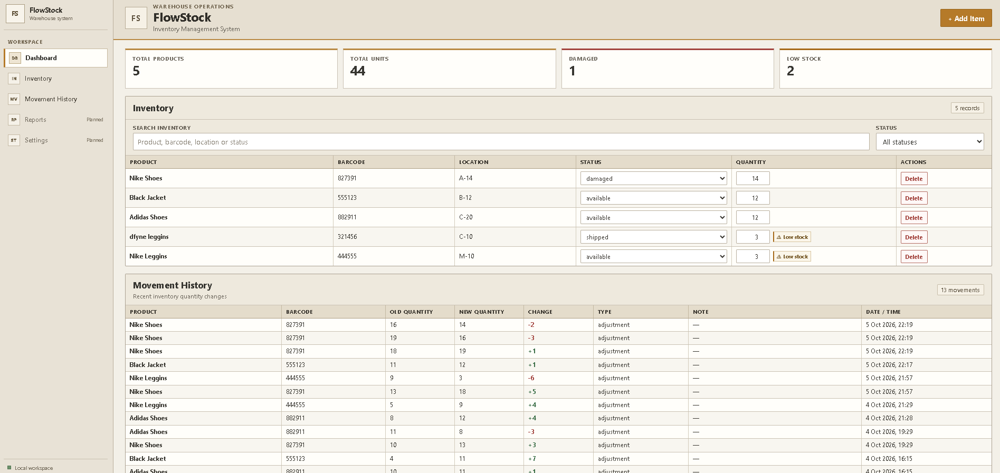

# FlowStock

## Screenshot



FlowStock is a full-stack inventory management portfolio project inspired by practical warehouse workflows. It helps a small warehouse team keep a clear record of products, stock levels, item status, and quantity changes in one place.

The project focuses on common operational tasks: finding an item, editing its status or quantity, spotting low stock, and reviewing a reliable history of stock adjustments.

## Key features

- Create, view, update, and delete inventory items
- Search by product name, barcode, location, or status
- Filter inventory by status
- Edit item status and quantity
- Inline low-stock warnings
- Dashboard totals for products, units, damaged items, and low-stock items
- Movement history showing old and new quantities, the change, movement type, note, and timestamp
- Transaction-based quantity updates that save the item quantity and its movement record together
- Loading, error, and empty states
- Responsive, compact enterprise-style interface

## Technology

- **Frontend:** React, TypeScript, and Vite
- **Backend:** Go and the standard `net/http` package
- **Database:** PostgreSQL
- **Communication:** JSON over a REST API
- **Testing:** Go's `testing` package and `net/http/httptest`, plus PostgreSQL integration tests
- **Version control:** Git

## Architecture

```text
React frontend (Vite) ── HTTP / JSON ──▶ REST API (Go) ── SQL ──▶ PostgreSQL
```

The frontend API layer in `frontend/src/api/` contains the HTTP calls for inventory and movement history. React components in `frontend/src/components/` handle the summary, inventory table, add-item form, and movement log. `App.tsx` coordinates page state, data loading, search, and status filtering; shared frontend data types live in `frontend/src/types.ts`.

The Go application serves the REST endpoints and uses PostgreSQL for persistent inventory data. Quantity changes and their movement-history records are written in one database transaction.

## Database design

The schema has two main tables:

- **`items`** stores each product's unique barcode, name, location, status, and current quantity. A check constraint prevents negative quantities.
- **`inventory_movements`** stores a quantity-change record with the related item, old and new quantities, quantity difference, movement type, optional note, and creation time.

`inventory_movements.item_id` references `items.id` with `ON DELETE CASCADE`, so removing an item also removes its associated movement records. When a quantity changes, the backend locks and updates the item, inserts its movement record, and commits both operations together. If the movement insert fails, the transaction rolls back the item update as well. A status-only update does not create a quantity movement.

SQL files in `database/migrations/` define the schema and its indexes. Apply migrations in numerical order on a fresh database: `001_initial_schema.sql`, then `002_add_movement_indexes.sql`. The original manually-created development database already has the schema from migration 001, so it should receive only migration 002. See [database/README.md](database/README.md) for the migration notes.

## Testing and checks

`main_test.go` contains handler tests using `httptest`. They exercise invalid request bodies, required fields, negative quantities, and CORS preflight behavior without starting the real server or connecting to PostgreSQL.

`integration_test.go` checks database-backed quantity updates: the item and exactly one movement are saved together, status-only updates do not add a movement, and a movement-write failure rolls back the item quantity. These tests use a separate PostgreSQL database named `flowstock_test` through `TEST_DATABASE_URL`. They skip the database-backed tests when that variable is unset, reject the normal `flowstock` database name, and apply the migrations to the test database during setup. The test records and removes its own fixture items; keep this database dedicated to testing.

Run the available Go tests and frontend checks from the project root in PowerShell:

```powershell
go test ./...
npm.cmd --prefix frontend run build
npm.cmd --prefix frontend run lint
```

The frontend build runs TypeScript compilation and the Vite production build. The lint command runs the configured Oxlint checks.

## Run locally on Windows

### Prerequisites

- Go 1.27.1, as declared in `go.mod`
- Node.js and npm
- PostgreSQL, with `createdb` and `psql` available in PowerShell (or use pgAdmin)
- Git

### Create a development database

For a new, empty local database, open PowerShell in the project root and create the database:

```powershell
createdb flowstock
```

Apply the schema migrations in numerical order:

```powershell
psql -d flowstock -f database/migrations/001_initial_schema.sql
psql -d flowstock -f database/migrations/002_add_movement_indexes.sql
```

If you already use the original manually-created FlowStock database, do not run migration 001 against it. Apply only the index migration:

```powershell
psql -d flowstock -f database/migrations/002_add_movement_indexes.sql
```

You can create the database and run these SQL files with pgAdmin instead. Migration 001 is for a new, empty database; it is not an upgrade script for an existing FlowStock database.

### Configure the backend

Create a `.env` file in the project root with your local development connection string:

```dotenv
DATABASE_URL=postgres://<your_postgres_user>:<your_local_password>@localhost:5432/flowstock?sslmode=disable
```

Replace the placeholders on your computer. Do not put real credentials in this README or commit `.env`; the root `.gitignore` excludes it. The Go server loads this file when it starts.

### Start the application

In one PowerShell window, from the project root, start the Go API:

```powershell
go run .
```

In a second PowerShell window, install frontend dependencies and start Vite:

```powershell
npm.cmd --prefix frontend install
npm.cmd --prefix frontend run dev
```

Open the local frontend address printed by Vite. The frontend calls the Go API at `http://localhost:8080`.

### Run PostgreSQL integration tests safely

Create a separate, dedicated test database. Do not point `TEST_DATABASE_URL` at your development database:

```powershell
createdb flowstock_test
$env:TEST_DATABASE_URL = 'postgres://<your_postgres_user>:<your_local_password>@localhost:5432/flowstock_test?sslmode=disable'
go test ./...
Remove-Item Env:TEST_DATABASE_URL
```

Replace the URL placeholders locally. The integration tests require a PostgreSQL URL whose database name ends in `_test`; they apply the migrations to that database automatically. If `TEST_DATABASE_URL` is not set, the database integration tests skip while the handler tests still run.

## Screenshots

### Dashboard / Inventory

Screenshot placeholder — add a dashboard and inventory screenshot here when available.

### Add Item

Screenshot placeholder — add an add-item form screenshot here when available.

### Movement History

Screenshot placeholder — add a movement-history screenshot here when available.

## Project structure

```text
flowstock/
├── main.go                         # Go REST API and PostgreSQL operations
├── main_test.go                    # HTTP handler tests using httptest
├── integration_test.go             # Isolated PostgreSQL integration tests
├── go.mod                          # Go module and dependencies
├── database/
│   ├── README.md                   # Database and migration instructions
│   └── migrations/
│       ├── 001_initial_schema.sql
│       └── 002_add_movement_indexes.sql
└── frontend/
    ├── package.json                # Frontend scripts and dependencies
    └── src/
        ├── api/                     # Inventory and movement API calls
        ├── components/              # Inventory, form, summary, and history UI
        ├── App.tsx                  # Page state and component composition
        └── types.ts                 # Shared TypeScript data types
```

## What I learned

Building FlowStock provided practice with REST API design, React state and component structure, PostgreSQL relationships, transaction handling, schema migrations, automated testing, and a Git workflow. I also used AI-assisted development with code review and validation to check changes and understand implementation choices.

## Future improvements

- Add a warehouse location map or minimap
- Add authentication and role-based access
- Support richer stock-movement reasons
- Deploy the application
